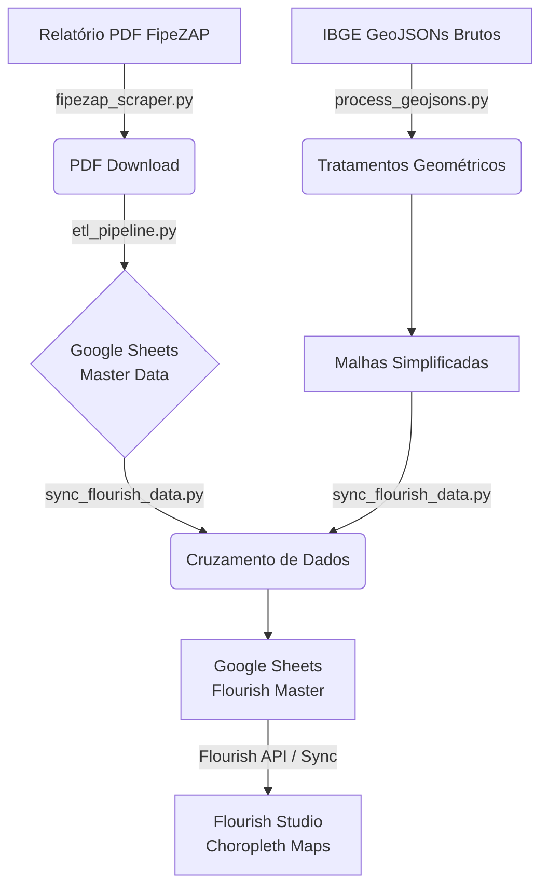

# 🏗️ Arquitetura do Pipeline FipeZAP Flourish

Este documento descreve a arquitetura detalhada, as decisões de design e o fluxo de dados do Pipeline ETL responsável por transformar os dados brutos dos relatórios mensais da FipeZAP em mapas interativos otimizados no Flourish Studio.

---

## 🏛️ Visão Geral da Arquitetura

O sistema opera em quatro estágios principais (Extração, Tratamento de Dados, Processamento Geoespacial e Sincronização), orquestrados por um script unificado (`run_pipeline.sh`) e agendados de forma autônoma na nuvem através do GitHub Actions.

## ⚙️ Componentes Principais

### 1. Web Scraping & Ingestão (`fipezap_scraper.py`)
- **Propósito:** Automatizar o download do relatório mensal de Venda/Locação Residencial do site da FipeZAP.
- **Funcionamento:** Utiliza requisições HTTPS simulando cabeçalhos de navegador (`curl_cffi` associado a `beautifulsoup4`) para raspar a página de downloads da FipeZAP, ignorando possíveis bloqueios de anti-bot (Cloudflare, etc). Ele obtém o link de download exato do PDF para o mês corrente de execução.

### 2. Conversão e Carga (`etl_pipeline.py`)
- **Propósito:** Extrair as tabelas embutidas dentro do PDF.
- **Funcionamento:** Utiliza `pdfplumber` para isolar visualmente as tabelas numéricas do documento em PDF, separando os bairros por capitais. Em seguida, interage diretamente com as APIs do Google (`gspread`) através do Service Account JSON file. Os dados extraídos alimentam a *"Planilha Base FipeZAP"* criando abas dinâmicas com o formato mês/ano (ex: `2026-01`, `2025-12`) preservando todo o histórico.

### 3. Tratamento Geométrico (`process_geojsons.py`)
- **Propósito:** Sanear as malhas dos bairros IBGE que formarão o mapa 3D no Flourish, efetuando *Simplificação Seletiva* e injeções de vértices.
- **Funcionamento:** Consome os polígonos da pasta `data/geojsons_brutos`. Realiza simplificação matemática e extrai centroides geográficos com a biblioteca espacial `shapely` / `geopandas` com o objetivo de reduzir o peso web da página. 
- **⚠️ Manipulação Crítica:** A matriz do IBGE não é 100% igual ao tracking comercial da FipeZAP. Este script contém filtros fixos para compensações manuais. Exemplo em São Paulo: 
    - Renomeação do _"Jardim Paulista"_ para **"Jardins"**.
    - Duplicação e offset de *0.0001 graus* da "_Vila Mariana_" para originar o polígono paralelo do **"Paraíso"** (sem que o renderizador do Flourish anule por sobreposição exata).

### 4. Sincronização e Renderização Final (`sync_flourish_data.py`)
- **Propósito:** Casar perfeitamente o índice dos bairros do GeoJSON tratado com a base histórica FipeZAP e enviá-los em array para a aba consumida pelo Flourish em tempo real (`mapas_flourish`).
- **Funcionamento:** A aplicação puxa o JSON recém-tratado e cruza string por string com o CSV da FipeZAP. Ele escreve os dados organizados nos exatos índices do Google Sheet do Flourish. 
- **⚠️ Ordenação Flourish:** O Flourish Studio possui uma engine que não faz join dinâmico. A linha 5 do Excel DEVE necessariamente referenciar a Feição Geométrica #5 da matriz vetorial enviada no momento que o mapa foi desenhado. Este script assegura esse comportamento não quebrando os IDs.

---

## ☁️ Automação na Nuvem (GitHub Actions)

O pipeline foi projetado para operar sem qualquer intervenção humana de forma *serverless*.
- **Onde:** Roda máquinas virtuais do tipo Ubuntu (via `ubuntu-latest`).
- **Gatilhos:** Agendamento temporal (`cron: '0 17 * * *'`), o que equivale a bater todos os dias às **14:00h do Horário Oficial de Brasília**. Suporta disparo manual via aba "*Actions*" (`workflow_dispatch`).
- **Credenciais:** Usa o GitHub Secrets para armazenar o JSON decodificado de Service Account do Google Workspace, construindo dinamicamente o `credentials/projeto-mkt-buyer-experience-ab8bb5499148.json` no momento isolado da rodada, destruindo-o depois.

## 📦 Dependências Essenciais (Python)
Garantidas via limitação no `requirements.txt`:
* **Acesso à Nuvem:** `gspread`, `google-auth`
* **Parsing PDF & Web:** `pdfplumber`, `curl_cffi`, `beautifulsoup4`
* **Operações Geográficas:** `geopandas`, `shapely`, `pandas`
